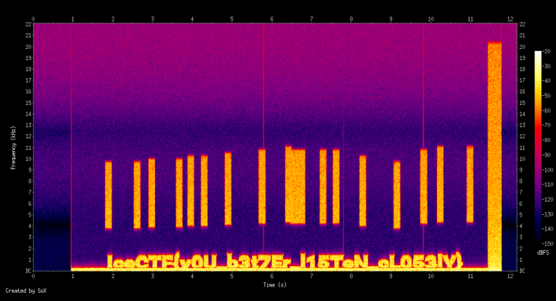

# IceCTF'2016
#### Audio Problems
#### Forensics / 50pts

## Description
We intercepted [this audio signal](https://play.icec.tf/problem-static/audio_problems_210b88f2232e1c9d770bb5d2069c47aabb86301b0adc7ad606956394a00f298b.wav), it sounds like there could be something hidden in it. Can you take a look and see if you can find anything? 

## Solution

Succes: [Sox](http://sox.sourceforge.net/)
```bash
sudo sox audio_problems_210b88f2232e1c9d770bb5d2069c47aabb86301b0adc7ad606956394a00f298b.wav -n spectrogram -z 130 -Z -20 -x 1000
```
You will get spectogram.png file with FLAG



## Flag
**IceCTF{y0U_b3t7Er_l15Ten_cL053lY}**
